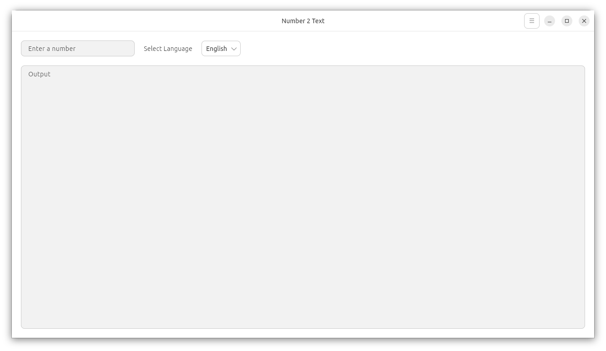

# Number 2 Text

Number 2 Text is a free, open-source application to convert numbers to text.

## Supported Languages

* English
* Spanish
* German
* French
* Russian

## Screenshots

<a href="screenshots/screenshot01.png"></a>
<a href="screenshots/screenshot02.png"></a>

## Installation

1. Download the latest `.deb` package from the project's GitHub releases page.
2. Open a terminal and navigate to the directory where you downloaded the file.
3. Install the package using the following command:

   ```bash
   sudo dpkg -i [name-of-the-package].deb
   ```

## Contributing

Contributions are welcome! If you have any ideas, suggestions, or bug reports, please feel free to open an issue or submit a pull request on the project's GitHub page.
